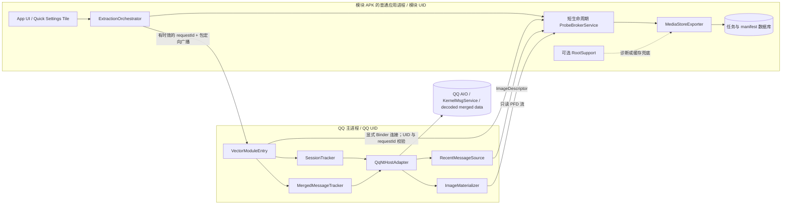

# QQ 图片提取器

当前目标环境：QQ `9.2.95`（versionCode `14200`）、Android 16、Vector/libxposed、Magisk root、SELinux Enforcing

参考 repo: [cinit/QAuxiliary](https://github.com/cinit/QAuxiliary.git)

## 1. 结论

采用一个独立 APK，同时承担两个角色：

1. 普通 Android 应用：提供任务入口、进度、错误报告和 MediaStore 导出。
2. Vector 模块：只向 QQ 主进程注入一个小型只读探针，取得当前会话、消息记录和图片数据流。

不 fork QAuxiliary，也不依赖 QAuxiliary 的“自定义附加功能”链加载器。新项目可以学习其分层、DexKit 解析和 QQNT 消息服务适配方式，但不得直接复制代码，除非先完成许可证审查并接受相应义务。

root 不进入正常读取链路。它只能作为显式开启的诊断或缓存文件兜底：root 能读取文件，却不能自然获得 QQ 进程中的 `AIOParam`、内核消息服务、临时鉴权参数和已解码的合并消息状态。

第一版只定义两个明确场景：

- `RECENT_CONVERSATION`：提取当前聊天最近 N 条消息中的图片。
- `CURRENT_MERGED_VIEW`：用户已经打开某个合并消息时，提取该合并消息中已经由 QQ 完整解码的数据集。

第二个场景在 QQ 9.2.95 上仍需技术验证。若只能取得屏幕已渲染的行，产品必须报告 `PARTIAL`，不得声称“全部图片”。

## 2. 审计范围与限制

本次是面向目标功能的架构审计，不是 QAuxiliary 全仓安全审计。检查范围包括：

- Vector/libxposed 与旧 Xposed 的加载链；
- 功能注册、初始化、进程限定和错误隔离；
- DexKit 去混淆及版本缓存；
- QQNT 当前会话、消息查询和图片元素处理；
- 合并消息相关入口；
- 外部模块链加载器；
- 与检测风险直接相关的逻辑；
- 自动化测试和 CI 边界。

结论来自静态源码和 git 历史。尚未对 QQ 9.2.95 做方法级动态追踪，所以本文把消息分页、合并消息完整数据源和原图物化方式列为 Phase 0 验证项。

## 3. QAuxiliary 是怎么做的

### 3.1 加载与初始化

```text
Vector / LSPosed
  -> libxposed API 100/101 统一入口
  -> 按宿主包名筛选
  -> ModuleLoader
  -> UnifiedEntryPoint
  -> HybridClassLoader
  -> StartupAgent / StartupRoutine
  -> MainHook
  -> HookInstaller
  -> KSP 生成的功能列表
  -> 各功能的 IDynamicHook.initialize()
```

关键证据：

- `loader/sbl/.../Lsp10xUnifiedHookEntry.java:43` 同时承接 libxposed API 100、101。
- `loader/sbl/.../lsp101/Lsp101HookEntry.java:60` 在 `onPackageReady` 中筛选 QQ/TIM，并于 `:84` 调用 `ModuleLoader.initialize`。
- `loader/startup/.../UnifiedEntryPoint.java:14` 建立统一启动入口。
- `loader/startup/.../HybridClassLoader.java:6` 分流 boot、loader、module、host 类，隔离 AndroidX、Kotlin、Guava 等冲突包。
- `app/src/main/java/io/github/qauxv/core/MainHook.java:106` 负责生命周期、资源、safe mode、早期 hook 和延迟 hook。
- `libs/ksp/.../FunctionHookEntryItemProcessor.kt:39` 在编译期生成注册表；`HookInstaller.java:53` 读取它。
- `IDynamicHook.kt:31` 统一定义可用性、目标进程、准备步骤、初始化状态和运行时错误。

这套结构最值得复用的不是具体类，而是三个原则：入口尽量薄、宿主兼容代码集中、耗时解析与 hook 安装分离。

### 3.2 功能与进程模型

QAuxiliary 的功能通常以一个 `IDynamicHook` 实现独立维护，通过注解自动注册。`BaseFunctionHook.kt:38` 统一保存开关、初始化结果、DexKit 前置步骤和错误。

贡献指南明确区分 QQ 主进程、`:MSF`、`:peak`、`:tool` 等，并说明大部分 UI 和逻辑位于主进程；`PROC_ANY` 不适合生产环境（`.github/CONTRIBUTING.md:139`）。

目标项目应只作用于：

- 包：`com.tencent.mobileqq`；
- 进程：QQ 主进程；
- 时机：Application/类加载器已经可用之后；
- 方法：少量 after-hook，保留原参数、返回值和异常。

不得加载到 `:MSF`、`:peak`、`:tool`、`:mini`，也不得使用 `PROC_ANY`。

### 3.3 去混淆与版本适配

QAuxiliary 使用三种信息寻找目标：稳定类名、字符串特征、DexKit 结构查询。候选必须经过参数、返回类型、类名等过滤；候选不唯一时倾向于失败，而不是任取一个。解析结果按 QQ versionCode 缓存：

- `DexKitTarget.kt:84`：缓存键为 `cache#目标名#宿主版本`；
- `DexKitTarget.kt:731`：以 `rootVMBuild`、`recursiveBuildVM` 定位 AIO 创建方法；
- `DexKitTarget.kt:738`：以 `ChatPie`、`onDestroy` 及类名约束定位销毁方法；
- `DexKitDeobfs.kt`：批量按字符串查询、过滤候选、保存方法描述符；
- `DexKit.kt:39`：失败结果同样缓存，避免每次启动反复扫描。

这是必要的版本适配层，不是一次性“去混淆”。QQ 更新后，特征、字段名和消息结构仍可能变化。目标项目必须维护自己的少量适配规则，但只维护与图片提取直接有关的目标，不继承 QA 的大规模目标库。

### 3.4 当前会话与最近消息

QAuxiliary 已经证明以下路径可行：

```text
AIO 创建/销毁 hook
  -> 当前 AIOParam
  -> AIOParam -> ContactCompat
  -> AppRuntime -> IKernelMsgService
  -> getMsgs / getMsgsByMsgId
  -> MsgRecord.elements
  -> MsgElement.picElement
```

证据：

- `SessionHooker.java:52` 监听 AIO 创建、销毁，并在 `:78` 维护 `AIOParam` 栈。
- `SessionUtils.java:37` 把 `AIOParam` 转为 `ContactCompat`；其中字段名按 QQ/TIM 版本分支。
- `MsgServiceHelper.java:49` 从 `AppRuntime` 取得 `IKernelMsgService`。
- `KernelMsgServiceCompat.java:72`、`:120` 兼容 `getMsgsByMsgId` 和 `getMsgs`，并桥接 `kernel.nativeinterface` 与 `kernelpublic.nativeinterface` 两套包名。
- `StickerPanelEntryHooker.java:274` 查询指定消息，`:283` 遍历 `MsgElement`，读取 `PicElement` 的 MD5 和原图 URL。
- `PicCopyToClipboard.kt:153` 展示了旧消息模型中单图、长消息片段和混合消息的本地图片路径处理；NT 分支则调用 QQ 的 `getLocalPath`。

目标项目应复刻这条“适配思路”，但输出自己的稳定 DTO，禁止把 QQ 对象、反射对象或内部类跨进程传递。

### 3.5 合并消息

QAuxiliary 对合并消息的支持是零散的，不存在可直接复用的“递归导出全部图片”服务：

- `OpenMultiFwdMsg.kt:109` 通过 `multi_url` 启动 `MultiForwardActivity`；
- `MultiForwardAvatarHook.kt:162` 证明 NT 的该 Activity 中可以从 `AIOMsgItem` 取得 `MsgRecord`；
- `DexKitTarget.kt:304` 定义了旧模型 `CMultiMsgManager`；
- `MultiActionHook.kt:203` 从旧 `MultiMsgManager` 取得列表，但用途是批量撤回，不是通用解码。

从可见消息 holder 收集数据会漏掉未渲染或未翻页的子消息。目标实现必须定位以下两者之一：

1. 合并消息解码完成后的完整 `List<MsgRecord>`；
2. 可控分页的数据源及明确的“已经到末页”信号。

找不到任一项时，`CURRENT_MERGED_VIEW` 不进入正式版本。

### 3.6 外部附加模块

QAuxiliary 的 chainloader 会：

- 从 APK 读取 `META-INF/qauxv/module.prop`；
- 校验配置的签名摘要；
- 用独立 `PathClassLoader` 加载 `Runnable` 入口；
- 仅向父加载器暴露 `chainloader` 和 `loader.hookapi` 包；
- 通过 `ChainLoaderAgent` 提供宿主 ClassLoader、Application、hook bridge 和进程名。

证据位于：

- `ExternalModuleChainLoader.java:48`、`:86`；
- `ChainLoaderParentClassLoader.java:27`；
- `ChainLoaderAgent.java:35`。

但该子系统的相关提交仍标记为 `wip`（`d14bb3d5`、`49d297c2`、`90675536`），接口范围小，并把新模块生命周期绑定到 QA。它适合作为实验入口，不适合作为该工具的长期基础。

### 3.7 检测相关逻辑

QAuxiliary 不是“什么都不做就直接注入”，但也没有完整、可证明的隐身层：

- `DisableQQCrashReportManager.kt:36` 默认启用并作用于所有进程，阻止可能带模块信息的 QQ 崩溃日志上报；`MainHook.java:120` 在早期初始化它。
- `CleanUpMitigation.java:41` 是常驻 hook；`:49` 列出若干模块文件名，并 hook `File.list/listFiles` 隐藏这些名称。
- `ChannelProxyHook.kt:41` 是默认关闭的实验功能，会替换 MSF 的环境上报发送方法；源码明确警告 QQ 9.1.30 及以上可能导致异常下线或冻结。当前目标 QQ 9.2.95 不应启用或模仿它。

这些是局部缓解，不会消除 Vector 注入、root、模块类、hook 框架特征、调用栈或行为异常等检测面。对目标项目不存在可信的“被检测概率百分比”；只能通过减少注入面降低相对风险。

## 4. 审计发现

### F1 — 高：直接复制 QA 代码存在许可证约束

证据：根 `LICENSE.md` 使用带非商业与传播限制的“通用许可协议”；不同源码头还出现 AGPL、GPL 和该自定义许可的不同表述。

影响：把 QA 类直接复制到独立 APK，可能使发布、源码提供、商业使用和署名义务变得复杂。

建议：只借鉴机制并独立实现；若复制任何实现，先逐文件确认版权头和许可证，由有资格的人完成合规判断。本文件不是法律意见。

验证：建立第三方代码清单；CI 检查复制来源、许可证和 NOTICE。

### F2 — 高：高变动适配层缺少持续回归门

证据：仓库主要 Java/Kotlin 源文件约 716 个，Android instrumented test 只有 1 个文件；PR CI 仅执行 `./gradlew :app:packageDebug`（`.github/workflows/pr_ci.yml:84`），没有运行消息兼容或 DexKit 解析测试。

影响：QQ 更新后，反射字段、方法特征和消息元素可能编译成功但运行失败，甚至产生不完整结果。

建议：目标项目把“适配器自检 + 真机样本矩阵 + 完整性标记”设为发布门；不支持的新版本必须 fail closed。

验证：每个支持的 QQ versionCode 保存一份不含聊天内容的 resolver 报告，并运行端到端提取用例。

### F3 — 中：chainloader 不是稳定扩展边界

证据：相关 git 提交均为 WIP；入口只约定构造器和 `Runnable`，公开 API 很小，生命周期由 QA 启动过程控制。

影响：使用 QA 附加功能会同时承受 QA 内部 API、加载器和发布节奏变化。

建议：独立 Vector 模块，拥有自己的入口、适配器、IPC 和故障策略。

验证：目标 APK 在未安装 QA 时能独立加载、查询与导出。

### F4 — 中：会话状态可能残留

证据：`SessionHooker.java:96` 在销毁时弹栈；栈变空后不向 decorator 发出 `null` 或 `None` 状态。

影响：消费者若缓存上一次 `AIOParam`，可能把已关闭会话当成当前会话。

建议：目标 `SessionTracker` 使用显式状态机，销毁最后一个会话时发布 `NoActiveSession`；请求还要校验 Activity token 和时间戳。

验证：进入聊天、退出、切换聊天、打开/关闭合并消息后分别执行请求，禁止导出上一会话内容。

### F5 — 中：版本知识分散在功能代码中

证据：`SessionUtils.java` 直接按版本选择 `d/e/f/g` 字段；其他功能也各自维护类名和字段分支。

影响：同一 QQ 更新可能需要修改多个功能，且很难判断支持边界。

建议：目标项目只允许 `adapter-qqnt` 引用宿主类名、字段名、DexKit 特征和版本号；业务层只能依赖 `HostAdapter`。

验证：静态架构测试禁止 `app`、`contract`、`export` 包出现 `com.tencent.*` 或反射调用。

### F6 — 低：缺少权威架构文档

证据：仓库有贡献指南和局部说明，但没有发现 architecture/design/ADR 文档；真实结构需要从加载器、基类和功能代码反推。

影响：新贡献者容易把宿主兼容、UI、存储和 hook 混在一起。

建议：目标项目把本文转为受版本控制的架构说明，并用 ADR 记录 IPC、合并消息数据源和原图物化决策。

## 5. 目标、非目标与约束

### 目标

- 用户显式触发，一次导出当前会话最近消息或当前已打开合并消息里的全部可取得图片。
- 保留原图优先，按 MD5 去重，输出可审计的 manifest 和逐项错误。
- QQ 内不增加菜单、按钮、布局、资源或持久通知。
- QQ 升级造成适配失效时安全停止，不返回错误会话或假完整结果。
- 正常路径不需要 root；卸载模块后不在 QQ 私有目录留下项目数据。

### 非目标

- 不读取全部历史数据库，不做全局聊天归档。
- 不修改、发送、撤回或伪造消息。
- 不 hook MSF 协议、网络发送、安全检测、崩溃上报和文件枚举。
- 不尝试隐藏 Vector、root 或模块本身。
- 不抓屏、不使用 OCR，不把缩略图冒充原图。
- 第一版不支持后台持续监控、自动导出和多账号批处理。

### 约束

- QQ 内部 API 不稳定且混淆；必须有版本化适配器。
- Binder 不适合传输大图片；只能传小 DTO 和 `ParcelFileDescriptor`。
- URL、rkey、本地私有路径和聊天内容均视为敏感数据。
- root 环境不构成安全边界；安全设计主要阻挡普通第三方应用和误调用。

## 6. 目标架构



### 6.1 Gradle 模块建议

```text
:app                 普通 UI、任务编排、BrokerService、MediaStore、Room
:contract            AIDL、DTO、协议版本、错误码；不依赖 QQ 类
:probe                Vector 入口、会话/合并消息状态机、请求执行器
:adapter-spi          HostAdapter 接口与规范化领域模型
:adapter-qqnt         QQNT 9.2.x 反射、DexKit resolver、消息映射、物化
:root-support         可选 su 客户端；默认未启用
:host-stubs           compileOnly 的 QQ 接口桩
```

依赖方向：

```text
app -> contract
probe -> contract + adapter-spi + adapter-qqnt
adapter-qqnt -> adapter-spi + host-stubs + dexkit
root-support -> contract
```

禁止反向依赖。`app`、`contract`、`root-support` 不得依赖 Vector API、QQ stubs、DexKit 或反射工具；所有 `com.tencent.*` 名称只能出现在 `adapter-qqnt`。

### 6.2 组件职责

| 组件 | 唯一职责 | 明确禁止 |
|---|---|---|
| `VectorModuleEntry` | 校验包与主进程，安装最小 hook，注册触发接收器 | UI 注入、全进程加载、业务查询 |
| `SessionTracker` | 维护 `NoActiveSession / Active(sessionToken, contact)` | 保存原始消息、跨会话复用旧状态 |
| `MergedMessageTracker` | 维护当前合并消息 handle、分页状态和完整性 | 从可见 View 猜测“完整” |
| `QqNtHostAdapter` | 隔离所有 QQ 类、版本分支和反射 | MediaStore、任务 UI、root |
| `RecentMessageSource` | 有界分页查询并规范化消息 | 修改消息或直接联网 |
| `ImageMaterializer` | 把一个 `ImageRef` 转成只读 PFD | 把字节塞入 Binder DTO、记录 rkey |
| `ProbeBrokerService` | 匹配一次性请求、转发回调、校验 UID | 长期驻留、接受任意调用方 |
| `ExtractionOrchestrator` | 限流、取消、重试、去重、进度和结果汇总 | 接触 QQ 内部对象 |
| `MediaStoreExporter` | 原子写入公共图片目录并校验摘要 | 写 QQ 私有目录 |
| `RootSupport` | 版本/权限诊断和经确认的缓存兜底 | 数据库解密、常驻 root daemon |

## 7. 宿主适配边界

```kotlin
interface HostAdapter {
    val adapterId: String
    fun capabilities(): CapabilityReport
    fun currentSession(): SessionSnapshot
    suspend fun recentMessages(request: RecentRequest): MessagePageSequence
    fun currentMergedMessage(): MergedSnapshot
    suspend fun images(source: MessageSource): Sequence<ImageRef>
    suspend fun openImage(ref: ImageRef, quality: ImageQuality): MaterializedImage
}
```

该接口表达语义，不暴露 QQ 类型。实现必须遵守：

- 只在适配器内把 `AIOParam` 转为 `ContactKey`；
- 只在适配器内调用 `IKernelMsgService.getMsgs`；
- `MsgRecord` 在 QQ 进程内立即转换为不可变 `NormalizedMessage`；
- `PicElement` 转为不含 rkey 和原始私有路径的 `ImageRef`；
- 解析候选不唯一、字段类型不符或回调语义不符时 fail closed；
- QQ versionCode 未列入支持范围时只允许执行自检，不允许正式导出。

### 7.1 Resolver 策略

目标优先级从稳定到脆弱依次为：

1. 未混淆类或公开 kernel interface；
2. 类/方法签名与调用关系；
3. 多个字符串特征的交集；
4. 版本限定字段名；
5. 单个字段序号或“第一个同类型字段”，仅允许临时实验。

每个 resolver 必须有：目标 ID、支持版本范围、候选约束、唯一性断言、自检、失效错误码。缓存键至少包含：QQ package、versionCode、lastUpdateTime、adapter schema version。失败缓存只保持到上述任一值变化。

Dex 扫描不得发生在 QQ 主线程的正常启动关键路径。第一版可以在用户于模块 App 中执行“适配检测”后生成缓存，再重启 QQ 生效。

### 7.2 最小 hook 集

正式版上限为三类 hook：

1. AIO 创建 after-hook：捕获新的会话 token 和 contact。
2. AIO 销毁 after-hook：撤销 token；栈空时显式发布 `NoActiveSession`。
3. 合并消息数据源 after-hook：只接收解码/分页完成后的不可变快照。

不得 hook 每个消息气泡的绑定方法作为常规采集路径。该方法调用频繁、只能看到已渲染行，也扩大可检测面；它只能用于 Phase 0 观察数据结构。

## 8. IPC 与授权

普通签名权限不能直接用于 QQ 侧探针，因为探针运行时的 Linux UID 是 QQ UID，而不是模块 UID。因此采用一次性请求握手：

1. 用户在模块 App 或 Quick Settings Tile 发起任务。
2. App 启动短生命周期 `ProbeBrokerService`，生成随机 128-bit `requestId`，记录请求类型、参数、创建时间和 30 秒握手期限。
3. App 向 `com.tencent.mobileqq` 发送 package-scoped 自定义广播，只携带 `requestId`。
4. QQ 主进程内的动态 receiver 收到后，以显式 component 绑定模块的 Broker。
5. Broker 对每个 Binder 入口同时验证：
   - `Binder.getCallingUid()` 等于当前安装的 `com.tencent.mobileqq` UID；
   - `requestId` 存在、未过期、未消费；
   - 当前控制端仍持有该任务；
   - 协议版本兼容。
6. 握手成功后 requestId 立即变为单次消费；数据通过回调和只读 PFD 流动。
7. 完成、取消、超时或任一进程死亡后，双方关闭 PFD、解绑并清除内存状态。

`ProbeBrokerService` 必须显式导出，因为 QQ UID 需要绑定；不得把“exported”本身当作授权。其他 UID 一律在 Binder 方法入口拒绝。QQ UID 内的其他注入代码无法与探针强隔离，这属于同进程信任边界限制。

Phase 0 必须在 Android 16 和当前 Vector 上验证：package-scoped 广播、动态 receiver、从 QQ 前台进程绑定 Broker、进程死亡清理。若平台限制该链路，再评估 Vector 提供的远程服务能力；不得直接退回世界可读文件或无鉴权 socket。

## 9. 数据合同

所有 DTO 都带 `protocolVersion`、`requestId`、QQ versionCode 和 `adapterId`。

### 9.1 请求

```text
ExtractionRequest
  source: RECENT_CONVERSATION | CURRENT_MERGED_VIEW
  recentLimit: 1..500             默认 100
  imageLimit: 1..500              默认 200
  quality: ORIGINAL_PREFERRED | BEST_LOCAL
  recursiveMergedDepth: 0..3      第一版默认 0
  byteBudget: 1 MiB..1 GiB        默认 512 MiB
```

### 9.2 图片描述

```text
ImageDescriptor
  imageId                         单任务内随机句柄
  sourceMessageId
  elementIndex
  sentAt
  normalizedMd5                   可空
  mimeType                        可空
  width / height / expectedBytes  可空
  availability: LOCAL_ORIGINAL | LOCAL_PREVIEW | HOST_FETCH_REQUIRED | UNAVAILABLE
```

DTO 禁止包含：QQ Java 对象、rkey、Cookie、完整原图 URL、QQ 私有绝对路径、发送者昵称或正文。

### 9.3 物化响应

`openImage(imageId)` 返回：只读 `ParcelFileDescriptor`、实际质量、MIME、预计长度和错误码。探针优先打开现有原图缓存；不存在时只能调用已经验证的 QQ 原生图片下载/缓存能力。控制端不自行拼接 QA 示例中的 qpic URL，也不长期保存临时鉴权参数。

Binder 只传描述符和小型批次 DTO。单批上限 50 项，禁止传图片 byte array。

### 9.4 完整性与错误

任务结果必须携带：

```text
completeness: COMPLETE | PARTIAL_PAGED | PARTIAL_VISIBLE | UNKNOWN
scannedMessages
foundImages
exportedImages
deduplicatedImages
failedImages
nextCursor                       若可继续
errors[]                         稳定错误码，不含敏感内容
```

关键错误码至少包括：

- `NO_ACTIVE_SESSION`
- `SESSION_CHANGED`
- `NO_OPEN_MERGED_MESSAGE`
- `UNSUPPORTED_QQ_VERSION`
- `RESOLVER_AMBIGUOUS`
- `QUERY_TIMEOUT`
- `MERGED_DATA_INCOMPLETE`
- `ORIGINAL_UNAVAILABLE`
- `BYTE_BUDGET_EXCEEDED`
- `BROKER_AUTH_FAILED`
- `PROBE_PROCESS_DIED`

只有确认到达消息数据源末尾时才能返回 `COMPLETE`。

## 10. 两条核心流程

### 10.1 最近会话

1. 探针取得带 token 的当前 `SessionSnapshot`。
2. 把 contact 交给 `KernelMsgService` 适配器，从最新锚点开始有界分页。
3. 回调结果立即转为 `NormalizedMessage`，按消息 ID 去重。
4. 遍历 `MsgElement`，为每个 `PicElement` 生成 `ImageRef`。
5. 每次分页前后校验 session token；用户切换聊天即取消，返回 `SESSION_CHANGED`。
6. 控制端逐个请求 PFD、流式计算 SHA-256、按 MD5/SHA-256 去重并写入 MediaStore。
7. 写入 manifest；任务结束后探针丢弃全部 message/image handle。

不得假设 `getMsgs` 的锚点、方向或结束条件。Phase 0 要用 1、恰好一页、多页和不足一页的会话验证分页语义。

### 10.2 当前合并消息

1. 用户先在 QQ 打开目标合并消息，再从快捷设置或模块 App 发起任务。
2. `MergedMessageTracker` 必须已经持有与当前 Activity 实例绑定的 `mergedToken`。
3. 适配器从完整解码回调或可终止分页数据源取得子 `NormalizedMessage`。
4. 遍历所有子消息图片；若启用递归，则按 merged resource ID 做环检测并受深度、消息数、图片数和字节预算约束。
5. Activity 销毁、token 改变或数据源未到末尾时，任务取消或标记 `PARTIAL`。

第一版不通过自动启动或操纵 QQ UI 来偷偷打开合并消息。这样既降低行为变化，也使“当前打开的单个合并消息”语义可验证。

## 11. 导出、隐私与故障处理

- 输出目录：MediaStore 的 `Pictures/QQExtract/<yyyy-MM-dd>/<requestId-short>/`。
- 文件名：发送时间、消息 ID、元素序号和短摘要组成；最终扩展名由实际 MIME 决定。
- 使用 `IS_PENDING` 写入，校验完成后再发布；失败项删除未完成记录。
- 默认按规范化 MD5 去重；MD5 缺失或不可信时使用流式 SHA-256。
- manifest 记录来源类型、QQ/adapter 版本、计数、完整性、文件名、摘要和错误码，不记录聊天正文、昵称、rkey、URL、私有路径。
- 日志默认只含阶段、耗时、计数、resolver ID 和错误码。调试日志须显式开启并自动过期。
- 查询和物化都支持取消；QQ 或 Broker 死亡后不自动重试到另一会话。
- 默认并发物化 2，查询单页超时 10 秒，单图超时 60 秒，总任务受字节预算限制。

## 12. root 边界

`RootSupport` 默认关闭，只允许：

- 检查 `su`、SELinux、QQ UID/versionCode 和目标缓存文件是否存在；
- 当 QQ 原生物化失败、用户明确确认后，把一个已知且经过 canonical-path 校验的图片缓存文件以只读流交给 exporter；
- 收集脱敏的权限/文件类型诊断。

禁止：

- 遍历整个 QQ 私有目录；
- 直接修改 QQ 文件或数据库；
- 尝试解密全量消息库；
- 用 root 常驻 daemon 监控 QQ；
- 把 SELinux 改为 Permissive；
- 把 QQ 私有路径直接暴露给 UI 或日志。

root 兜底必须使用 allowlist 根目录、`realpath`/canonical path 校验、只读打开、大小上限和 MIME sniffing。拥有 root 的恶意主体可绕过应用级 IPC 授权，不在该威胁模型内。

## 13. 检测风险控制

无法给出可靠概率。不可避免的基础风险是 Vector 已向 QQ 注入模块代码；root/Magisk 和框架本身也可能被检测。目标架构只减少新增暴露：

- 仅 QQ 主进程，最多三类 hook；
- 只用 after-hook 观察状态，不替换返回值、不改参数；
- 不注入 QQ 菜单、View、资源或 Activity；
- 不 hook MSF、网络、环境上报、崩溃上报、PackageManager、ClassLoader、文件枚举；
- QQ 进程内不创建模块配置、日志或导出文件；
- 请求完全由用户触发，有数量、并发和字节上限；
- 不持久化 QQ 对象、临时 URL、rkey 或联系人正文；
- 解析失败即禁用能力，不尝试宽泛反射扫描并继续运行。

相对风险排序：

```text
仅 Vector 注入 + 两个会话生命周期 hook
  < 增加合并消息数据源 hook
  < 高频消息 View hook / 多进程 hook
  < MSF、网络、安全或反检测方法替换
```

该排序只是攻击面比较，不是封号概率估计。测试也只能发现明显异常，不能证明“不会检测”。

## 14. 测试与发布门

### 14.1 自动化测试

- `contract`：协议版本、分页 cursor、错误码、超限和向后兼容测试。
- `adapter-spi`：消息规范化、图片去重、嵌套合并环检测、完整性状态测试。
- `app`：PFD 流、取消、进程死亡、MediaStore 原子写和恢复测试。
- 架构测试：禁止非 adapter 模块出现 `com.tencent.`、DexKit、反射或 Xposed import。
- resolver 测试：对合法唯一、零候选、多候选三种情况分别验证；多候选必须失败。

### 14.2 真机矩阵

至少覆盖：

- 私聊、群聊；
- 单图、多图、图文混合、GIF；
- 原图已缓存、只有缩略图、需要 QQ 下载、下载失败；
- 最近消息为 0、1、恰好一页、多页；
- 快速切换会话、退出聊天、锁屏、杀死 QQ、杀死 Broker；
- 合并消息 0 图、多页、多图、嵌套、过期/加载失败；
- Vector API 100 与 101 中实际使用的版本；
- QQ 9.2.95 及每个后续明确宣称支持的 versionCode。

### 14.3 验收标准

- 不打开会话时返回 `NO_ACTIVE_SESSION`，绝不使用旧 contact。
- 会话切换过程中任务返回 `SESSION_CHANGED`，不混入另一个聊天。
- 已知含 10 张唯一图片的最近 100 条消息导出恰好 10 张，manifest 计数一致。
- 已知含 30 张图片的合并消息只有在确认遍历末尾后返回 `COMPLETE`；否则明确返回 `PARTIAL_*`。
- 500 张图片或 512 MiB 预算触发上限后可预测停止，不导致 QQ ANR/OOM。
- QQ 冷启动额外同步耗时目标小于 20 ms；Dex 扫描不计入且不得位于冷启动主线程。
- 禁用模块或卸载 APK 后，QQ 中无残留 UI、receiver、线程和私有文件。

## 15. 分阶段实施

### Phase 0：可行性验证，不发布

1. 建立最小 Vector API 100/101 入口，只加载 QQ 主进程。
2. 验证 Android 16 上的一次性广播 + Binder/PFD 握手及 UID 校验。
3. 定位 AIO create/destroy，证明退出后状态能清空。
4. 验证 QQ 9.2.95 `getMsgs` 的锚点、顺序、分页末尾和回调线程。
5. 找到合并消息的完整解码列表或可终止分页数据源。
6. 验证“本地原图优先、否则调用 QQ 原生物化”的稳定入口。

退出条件：第 1–4 项必须全部通过，才能开发最近会话 MVP；第 5 项通过后才能承诺合并消息“全部图片”。第 6 项失败时，MVP 只能明确标记并导出 `BEST_LOCAL`。

### Phase 1：最近会话 MVP

- 实现模块边界、会话状态机、消息分页、PicElement 规范化、PFD、MediaStore 和 manifest。
- 仅支持 QQ 9.2.95；默认最近 100 条、最多 200 图、512 MiB。
- App 内提供适配自检、开始、取消、进度和结果页；可选 Quick Settings Tile。

### Phase 2：当前合并消息

- 实现经过 Phase 0 验证的数据源适配器。
- 第一版仅一层，先保证完整性；嵌套递归另行启用。
- 对分页、Activity 销毁和不完整数据做强制状态标记。

### Phase 3：硬化

- 增加版本 fixture、真机回归脚本、架构规则和发布矩阵。
- 增加可选 root 缓存兜底，但保持默认关闭。
- 每次 QQ 更新先运行 resolver/self-test，再扩大支持版本范围。

## 16. 被否决的方案

| 方案 | 决定 | 原因 |
|---|---|---|
| 直接改 QA / 长期维护 QA fork | 否决 | 目标很窄，却要承担整个 QA 的更新、许可证、功能和检测面 |
| 使用 QA 外部 chainloader | 否决 | WIP、私有接口窄、生命周期耦合 QA，不能消除自身 QQ 适配 |
| 纯 root 外部 App | 否决为主路径 | 无法可靠取得当前内存会话、内核服务、临时鉴权与完整合并解码状态 |
| Accessibility / 屏幕资源遍历 | 否决 | 只能看到 UI/缩略图和已渲染项，无法证明原图与完整性 |
| Frida 常驻脚本 | 否决为产品形态 | 适合 Phase 0 观察，不适合稳定生命周期、IPC、版本适配和用户操作 |
| 在 QQ 内增加菜单按钮 | 暂不采用 | 与“外部软件”目标冲突，也增加 UI hook 和资源注入面 |
| 自己拼 qpic URL 下载 | 否决 | rkey/URL 会过期且敏感，会复制 QQ 网络协议并扩大行为差异 |

## 17. 默认产品决策

- 触发入口：模块 App + Quick Settings Tile；不改 QQ UI。
- 最近范围：默认 100 条，允许 1–500。
- 图片质量：`ORIGINAL_PREFERRED`，失败时逐项报告，不静默降级。
- 合并消息：只处理当前已经打开的一个；未确认完整数据源前不发布。
- root：默认关闭，只作诊断/缓存兜底。
- QQ 支持：白名单 versionCode；初始只支持已验证的 `14200`。
- 失败策略：fail closed，永不把部分结果标记为全部。

## 18. 后续需要形成的 ADR

Phase 0 完成后，把以下实测结论固化为 ADR：

1. `ADR-001 IPC transport`：Android 16 + Vector 上最终采用的广播/Binder 或框架远程服务方案。
2. `ADR-002 Recent pagination`：`getMsgs` 的锚点、方向、末页判定和线程模型。
3. `ADR-003 Merged source`：完整合并消息数据源、分页与生命周期。
4. `ADR-004 Image materialization`：原图本地路径与 QQ 原生下载入口、失败语义。
5. `ADR-005 Licensing`：是否引用任何 QA 代码以及对应义务。

在这些决策落地前，不应先搭建大而全的模块框架。最先写的代码应是可丢弃的 Phase 0 探针，用它回答 IPC、分页、合并数据源和原图物化四个不确定问题。
